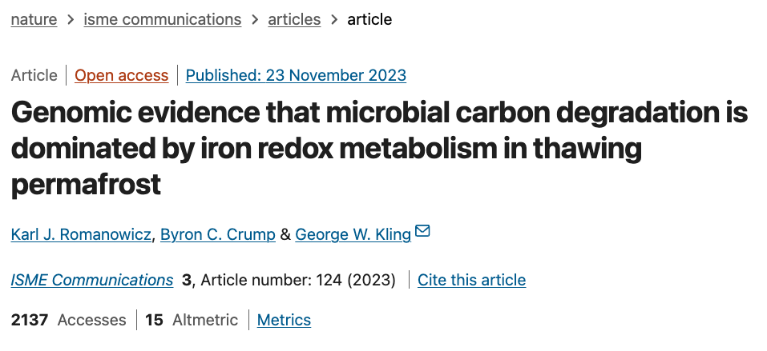

# Microbial Response to Experimental Permafrost Thaw

### [Karl J. Romanowicz](https://kromanowicz.github.io/), Byron C. Crump, and George W. Kling

_____________________________________

Romanowicz KJ, Crump BC, Kling GW. (2023) Genomic evidence that microbial carbon degradation is dominated by iron redox metabolism in thawing permafrost. ***ISME Communications***. [DOI: 10.1038/s43705-023-00326-5](https://www.nature.com/articles/s43705-023-00326-5)

**Links to Rendered Code:** 

[16S Analysis]()

[MG Analysis]()

**NCBI BioProject:**

[PRJNA976224](https://www.ncbi.nlm.nih.gov/bioproject?term=PRJNA976224&cmd=DetailsSearch) for raw .fastq files

**Direct any questions regarding this repository to lead author:** [Karl J. Romanowicz](mailto:kjromano@umich.edu).
_____________________________________

**Manuscript Abstract:**

Microorganisms drive many aspects of organic carbon cycling in thawing permafrost soils, but the compositional trajectory of the post-thaw microbiome and its metabolic activity remain uncertain, which limits our ability to predict permafrost–climate feedbacks in a warming world. Using quantitative metabarcoding and metagenomic sequencing, we determined relative and absolute changes in microbiome composition and functional gene abundance during thaw incubations of wet sedge tundra collected from northern Alaska, USA. Organic soils from the tundra active-layer (0–50 cm), transition-zone (50–70 cm), and permafrost (70+ cm) depths were incubated under reducing conditions at 4 °C for 30 days to mimic an extended thaw duration. Following extended thaw, we found that iron (Fe)-cycling Gammaproteobacteria, specifically the heterotrophic Fe(III)-reducing Rhodoferax sp. and chemoautotrophic Fe(II)-oxidizing Gallionella sp., increased by 3–5 orders of magnitude in absolute abundance within the transition-zone and permafrost microbiomes, accounting for 65% of community abundance. We also found that the abundance of genes for Fe(III) reduction (e.g., MtrE) and Fe(II) oxidation (e.g., Cyc1) increased concurrently with genes for benzoate degradation and pyruvate metabolism, in which pyruvate is used to generate acetate that can be oxidized, along with benzoate, to CO2 when coupled with Fe(III) reduction. Gene abundance for CH4 metabolism decreased following extended thaw, suggesting dissimilatory Fe(III) reduction suppresses acetoclastic methanogenesis under reducing conditions. Our genomic evidence indicates that microbial carbon degradation is dominated by iron redox metabolism via an increase in gene abundance associated with Fe(III) reduction and Fe(II) oxidation during initial permafrost thaw, likely increasing microbial respiration while suppressing methanogenesis in wet sedge tundra.
